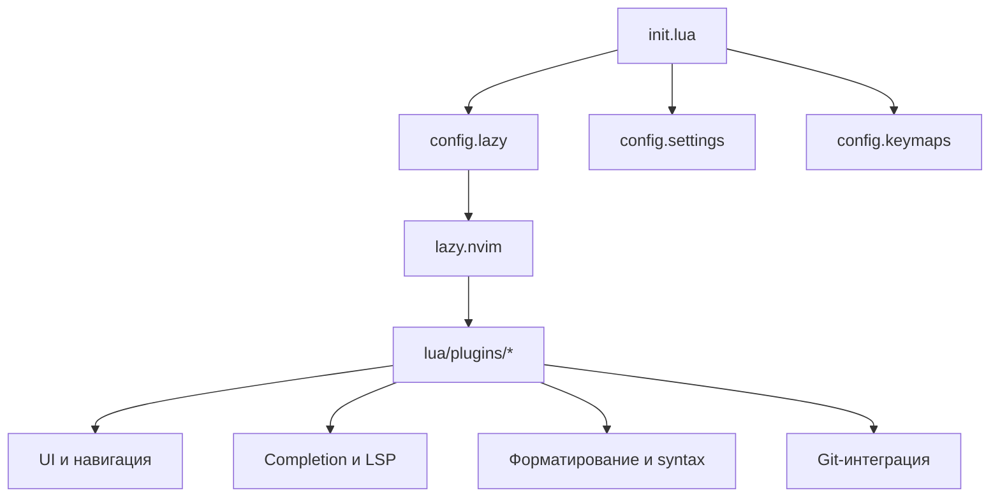

# Neovim configuration

Локальная конфигурация Neovim на Lua с менеджером плагинов [`lazy.nvim`](https://github.com/folke/lazy.nvim).

## Быстрый старт

Требования:

- Neovim 0.10 или новее;
- `git` и `curl` для bootstrap `lazy.nvim`;
- внешние инструменты форматирования и LSP-серверы, перечисленные ниже.

После установки dotfiles через `stow` запусти:

```sh
nvim
```

При первом запуске `lazy.nvim` установит плагины согласно [lazy-lock.json](lazy-lock.json).

Полезные команды внутри Neovim:

```vim
:Lazy
:Lazy sync
:checkhealth
:LspInfo
:ConformInfo
```

## Архитектура



[init.lua](init.lua) загружает модули в следующем порядке:

1. [lua/config/lazy.lua](lua/config/lazy.lua) — bootstrap менеджера плагинов, `mapleader` и импорт `lua/plugins`.
2. [lua/config/settings.lua](lua/config/settings.lua) — глобальные опции редактора.
3. [lua/config/keymaps.lua](lua/config/keymaps.lua) — глобальные mappings.

## Структура файлов

```text
.
├── init.lua
├── lazy-lock.json
├── lua
│   ├── config
│   │   ├── keymaps.lua
│   │   ├── lazy.lua
│   │   └── settings.lua
│   └── plugins
│       ├── alpha-greeter.lua
│       ├── cmp.lua
│       ├── conform.lua
│       ├── gitsigns.lua
│       ├── hydra.lua
│       ├── init.lua
│       ├── lspconfig.lua
│       ├── lualine.lua
│       ├── theme.lua
│       ├── tree-sitter.lua
│       └── which-keys.lua
└── .luarc.json
```

Каждый файл в `lua/plugins` возвращает plugin spec для `lazy.nvim`. Общие плагины и плагины без отдельной настройки собраны в `lua/plugins/init.lua`.

## Возможности

### Интерфейс и навигация

- Catppuccin Macchiato — цветовая схема.
- Lualine — statusline с branch, diff, diagnostics, filetype и активным LSP.
- Bufferline — навигация по открытым buffers.
- NvimTree — файловое дерево с синхронизацией корня проекта и Git-иконками.
- Telescope — поиск файлов, grep, buffers, history, keymaps и registers.
- Hydra — режимы управления окнами и Telescope.
- Alpha — стартовый экран.
- Trouble и Undotree — диагностика и история изменений.

### Редактирование и completion

- `nvim-cmp` с источниками LSP, LuaSnip, Copilot, buffer и path.
- LuaSnip с `friendly-snippets`.
- `conform.nvim` для форматирования.
- Treesitter с включённой подсветкой; автоматически устанавливается parser Python.
- Autopairs, autotag и surround.

### LSP

В [lua/plugins/lspconfig.lua](lua/plugins/lspconfig.lua) настроены:

```text
emmet_ls       eslint          ts_ls
svelte         jsonls          lua_ls
phpactor       ruff            basedpyright
```

`nvim-lspconfig` только предоставляет конфигурации серверов. Исполняемые файлы LSP-серверов нужно устанавливать отдельно и сделать доступными в `PATH`.

### Форматирование

Настройки Conform находятся в [lua/plugins/conform.lua](lua/plugins/conform.lua):

| Тип файла | Formatter |
|---|---|
| Lua | `stylua` |
| Python | `ruff_format`, `ruff_fix` |
| JavaScript, TypeScript, Svelte | `prettier` |
| CSS, HTML, JSON, YAML, Markdown | `prettier` |

## Основные mappings

`<leader>` — пробел.

| Mapping | Действие |
|---|---|
| `jj` | Выйти из Insert mode |
| `<C-s>` | Форматировать и сохранить buffer |
| `<leader>f` | Форматировать buffer |
| `F2` | LSP rename |
| `gd`, `gr`, `gD` | Definition, references, declaration |
| `K`, `<C-k>` | Hover и signature help |
| `<C-b>` | Переключить NvimTree |
| `H`, `L` | Предыдущий/следующий buffer |
| `<leader>1..9` | Перейти к buffer по номеру |
| `F1` | Очистить подсветку поиска |
| `F5` | Переключить обычные и относительные номера строк |
| `<C-w>` | Hydra для управления окнами |
| `<F4>` | Hydra для Telescope |

## Обновление

Изменения конфигурации применяются после перезапуска Neovim. Для обновления плагинов:

```vim
:Lazy update
```

После изменения версий плагинов проверь и закоммить [lazy-lock.json](lazy-lock.json), чтобы сохранить воспроизводимое состояние.

## Известные ограничения

- Treesitter сейчас явно устанавливает только parser Python. Для других языков добавь их в `ensure_installed` в [lua/plugins/tree-sitter.lua](lua/plugins/tree-sitter.lua).
- Форматирование зависит от наличия `stylua`, `ruff` и `prettier` в `PATH`.
- LSP не устанавливает серверы автоматически.
- Настройка LSP использует legacy-интерфейс `nvim-lspconfig`; при переходе на новые версии Neovim её можно мигрировать на `vim.lsp.config()` и `vim.lsp.enable()`.
- В `settings.lua` остаются переменные `tagbar_*`, хотя Tagbar не входит в список плагинов.
