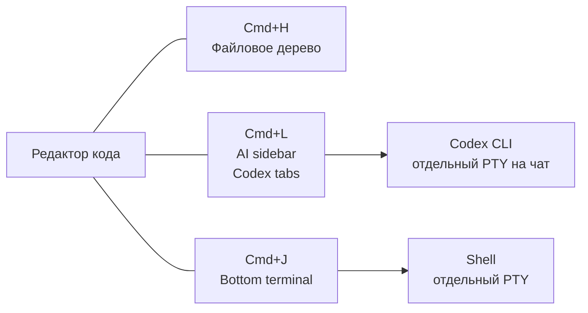
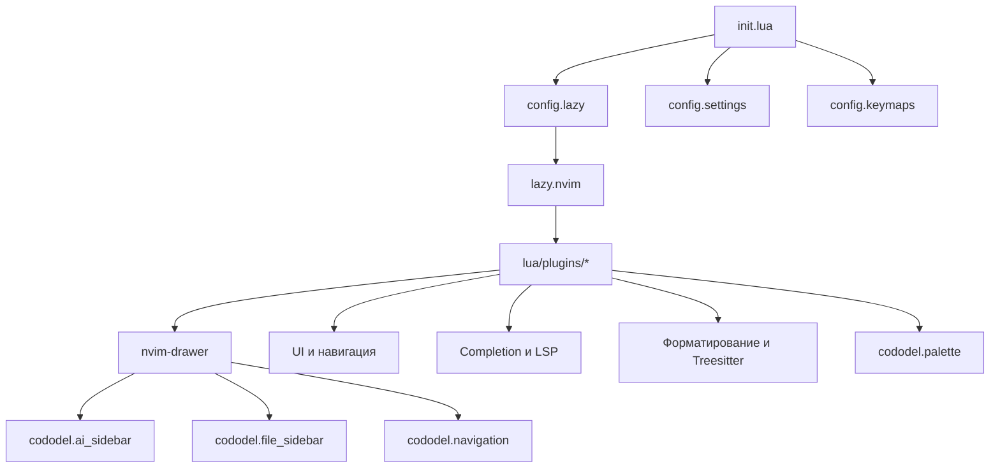

# Cododel: terminal-first Neovim editor

Это новый концепт редактора поверх Neovim: основной рабочий экран остаётся редактором кода, а AI, shell и файловая навигация живут в отдельных persistent-панелях. Панели можно скрывать, не завершая процессы, и возвращать фокус прямо в редактор.

Главный AI-инструмент — Codex CLI. Для этого интерфейса он выбран благодаря сочетанию сильных моделей, удобной квоты и CLI на Rust: terminal-first workflow хорошо соответствует производительности и отзывчивости самого редактора.

## Быстрый старт

Требования:

- Neovim 0.12 или новее;
- `git` и `curl` для bootstrap [`lazy.nvim`](https://github.com/folke/lazy.nvim);
- `rg` для live grep по содержимому проекта;
- `codex` в `PATH` для AI-панелей;
- внешние инструменты форматирования и LSP-серверы, перечисленные ниже.

После установки dotfiles через `stow` запусти:

```sh
nvim
```

При первом запуске `lazy.nvim` установит плагины согласно [lazy-lock.json](lazy-lock.json). Основной drawer-плагин [`nvim-drawer`](https://github.com/mikew/nvim-drawer) зафиксирован на конкретном commit, поскольку у проекта пока нет опубликованных релизов.

Полезные команды внутри Neovim:

```vim
:Lazy
:Lazy sync
:checkhealth
:LspInfo
:ConformInfo
```

## Концепция рабочего пространства



- Правый AI sidebar содержит несколько независимых terminal buffers и процессов Codex.
- Нижняя панель — отдельный shell и не участвует в переключении Codex-вкладок.
- NvimTree отвечает только за файловую навигацию.
- Снятие фокуса с панели не закрывает её и не останавливает процесс.

Модули workspace изолированы в [lua/cododel/ai_sidebar.lua](lua/cododel/ai_sidebar.lua), [lua/cododel/file_sidebar.lua](lua/cododel/file_sidebar.lua), [lua/cododel/navigation.lua](lua/cododel/navigation.lua) и [lua/cododel/palette.lua](lua/cododel/palette.lua). Они не меняют lifecycle LSP, completion, statusline или обычных терминалов.

## Управление панелями

### Directional navigation

| Mapping | Действие |
|---|---|
| `Cmd+H` | Из editor открыть/focus Files; из Files скрыть её и перейти в editor; из terminal перейти в Files; из AI перейти в editor |
| `Cmd+J` | Из editor, Files или AI открыть/focus terminal с запоминанием источника; из terminal скрыть его и вернуться к источнику |
| `Cmd+K` | Из bottom terminal всегда перейти в editor, не скрывая terminal |
| `Cmd+L` | Из editor открыть/focus AI; из AI скрыть его и перейти в editor; из Files перейти в editor; из terminal перейти в AI |
| `Cmd+P` | Открыть floating-поиск файлов; режимы picker переключаются прямо в popup |

Панель открывается, если она скрыта, получает фокус, если уже открыта, и скрывается при повторном нажатии из самой панели. Процессы и buffers при снятии фокуса не завершаются. Если editor pane отсутствует, fallback-фокусом становится файловое дерево.

Если переход к AI начинается из файлового дерева, выбранный node определяет cwd новой Codex-сессии: директория используется напрямую, а для файла берётся его parent directory. Путь сохраняется до следующего перехода в AI; при входе из editor или другой панели остаётся обычный git-root fallback.

### AI sidebar

| Mapping | Действие |
|---|---|
| `Shift+H` | Предыдущий Codex-чат в активном Codex terminal |
| `Shift+L` | Следующий Codex-чат в активном Codex terminal |
| `:CodexNew [name]` | Создать новый Codex-чат с отдельным процессом |
| `:CodexClose` | Остановить и закрыть активный Codex-чат |
| `:CodexRename [name]` | Переименовать активный чат |
| `:CodexPrev` / `:CodexNext` | Переключить предыдущий/следующий чат из командной строки |

Первое открытие AI sidebar лениво запускает только один процесс Codex. Каждый новый чат получает собственный PTY и собственный scrollback.

Каждый чат сохраняет cwd, с которым был запущен его процесс. Выбор файла в NvimTree не создаёт новый чат, если AI sidebar уже содержит живые сессии.

Если процесс Codex завершается, его terminal buffer и вкладка автоматически удаляются; остальные чаты продолжают работать.

### Bottom terminal

| Mapping | Действие |
|---|---|
| `Ctrl+D` | Завершить shell и автоматически закрыть нижнюю панель вместе с её buffer |
| `:ProjectTerminalToggle` | Открыть/скрыть нижнюю панель командой |

Bottom terminal независим от AI sidebar. В первой версии он содержит один shell process; для новых сессий после `Ctrl+D` панель создаёт новый shell при следующем открытии.

### Файловое дерево

Файловое дерево управляется через `Cmd+H/J/K/L`. Отдельные `Cmd+B`, `Cmd+Shift+B` и `Ctrl+B` не используются.
Внутри дерева `h` сворачивает текущую директорию, `l` раскрывает выбранную директорию только на один уровень и повторно не сворачивает её, а `Enter` делает выбранную директорию новым root. `l` ничего не делает на файлах.

## Настройка терминального профиля

Встроенные macOS-сочетания `Cmd` часто перехватываются iTerm2 или Ghostty. Поэтому терминальный профиль должен отправлять в Neovim уникальные escape sequences:

| Клавиша | Sequence |
|---|---|
| `Cmd+H` | `ESC[102~` |
| `Cmd+J` | `ESC[98~` |
| `Cmd+K` | `ESC[101~` |
| `Cmd+L` | `ESC[99~` |
| `Cmd+P` | `ESC[112~` |
| `Shift+H` | `ESC[72;2u` |
| `Shift+L` | `ESC[76;2u` |

`Cmd+H/J/K/L` обрабатываются navigation controller во всех нужных режимах, а `Shift+H/L` остаются buffer-local только в Codex terminal buffers. В обычных файлах стандартные Vim-команды `H` и `L` не изменены. Проверить пришедшую последовательность можно через `Ctrl+V` в Insert mode и `:verbose map`.

### Floating palette

`Cmd+P` открывает Telescope в центре экрана и сразу запускает поиск по именам файлов. Внутри popup доступны режимы:

| Mapping | Режим |
|---|---|
| `Ctrl+1` | Файлы |
| `Ctrl+G` | `rg` по содержимому проекта |
| `Ctrl+B` | Открытые buffers |
| `Ctrl+O` | Недавно открытые файлы |
| `Ctrl+;` | Команды Neovim |
| `Ctrl+Y` | Keymaps |

То же самое можно открыть командами `:CododelFiles`, `:CododelGrep`, `:CododelBuffers`, `:CododelRecent`, `:CododelCommands` и `:CododelKeymaps`. `:CododelPalette` — alias для поиска файлов.

В palette `Tab` только перемещает выбор вниз, `↑/↓` перемещают выбор по результатам, а `Esc` сразу закрывает popup. `Ctrl-[` также закрывает palette, не переводя её в Normal mode; `jj` остаётся обычным вводом в поиск. Multi-selection отключён.

Новых fuzzy-search зависимостей для панели не добавляется: `telescope.nvim` и `plenary.nvim` уже входят в конфигурацию и lock-файл. Поиск файлов использует `rg --files`, явно исключает `.git` и распространённые бинарные форматы. Для режима grep также нужен внешний `rg` в `PATH`.

## Архитектура



[init.lua](init.lua) загружает модули в следующем порядке:

1. [lua/config/lazy.lua](lua/config/lazy.lua) — bootstrap менеджера плагинов, `mapleader` и импорт `lua/plugins`.
2. [lua/config/settings.lua](lua/config/settings.lua) — глобальные опции редактора.
3. [lua/config/keymaps.lua](lua/config/keymaps.lua) — глобальные mappings.

## Структура файлов

```text
.
├── AGENTS.md
├── init.lua
├── lazy-lock.json
├── lua
│   ├── config
│   │   ├── keymaps.lua
│   │   ├── lazy.lua
│   │   └── settings.lua
│   ├── cododel
│   │   ├── ai_sidebar.lua
│   │   ├── file_sidebar.lua
│   │   ├── navigation.lua
│   │   └── palette.lua
│   └── plugins
│       ├── ai-sidebar.lua
│       ├── alpha-greeter.lua
│       ├── cmp.lua
│       ├── conform.lua
│       ├── gitsigns.lua
│       ├── init.lua
│       ├── lspconfig.lua
│       ├── lualine.lua
│       ├── theme.lua
│       ├── tree-sitter.lua
│       └── which-keys.lua
├── tests
│   ├── ai_sidebar_spec.lua
│   ├── navigation_spec.lua
│   └── run.sh
└── .luarc.json
```

Каждый файл в `lua/plugins` возвращает plugin spec для `lazy.nvim`. Общие плагины и плагины без отдельной настройки собраны в [lua/plugins/init.lua](lua/plugins/init.lua).

## Возможности

### Интерфейс и навигация

- Catppuccin Macchiato — цветовая схема.
- Lualine — statusline с branch, diff, diagnostics, filetype и активным LSP.
- Bufferline — навигация по открытым buffers.
- NvimTree — файловое дерево с синхронизацией корня проекта и Git-иконками.
- Telescope — поиск файлов, grep, buffers, history, keymaps и registers.
- Alpha — стартовый экран.
- Trouble и Undotree — диагностика и история изменений.

### Редактирование и completion

- `nvim-cmp` с источниками LSP, LuaSnip, Copilot, buffer и path.
- LuaSnip с `friendly-snippets`.
- `conform.nvim` для форматирования.
- Treesitter с новой API-веткой `main` и автоматическим запуском подсветки для Lua, Python и Markdown.
- Autopairs, autotag и surround.

### LSP

В [lua/plugins/lspconfig.lua](lua/plugins/lspconfig.lua) настроены:

```text
emmet_ls       eslint          ts_ls
svelte         jsonls          lua_ls
phpactor       ruff            basedpyright
```

`nvim-lspconfig` только предоставляет конфигурации серверов. Исполняемые файлы LSP-серверов нужно устанавливать отдельно и сделать доступными в `PATH`.

### Форматирование

Настройки Conform находятся в [lua/plugins/conform.lua](lua/plugins/conform.lua):

| Тип файла | Formatter |
|---|---|
| Lua | `stylua` |
| Python | `ruff_format`, `ruff_fix` |
| JavaScript, TypeScript, Svelte | `prettier` |
| CSS, HTML, JSON, YAML, Markdown | `prettier` |

## Обычные mappings

`<leader>` — пробел.

| Mapping | Действие |
|---|---|
| `jj` | Выйти из Insert mode |
| `<C-s>` | Форматировать и сохранить buffer |
| `<leader>f` | Форматировать buffer |
| `F2` | LSP rename |
| `gd`, `gr`, `gD` | Definition, references, declaration |
| `K`, `<C-k>` | Hover и signature help |
| `H`, `L` | Предыдущий/следующий buffer |
| `<leader>1..9` | Перейти к buffer по номеру |
| `F1` | Очистить подсветку поиска |
| `F5` | Переключить обычные и относительные номера строк |

## Обновление

Изменения конфигурации применяются после перезапуска Neovim. Для обновления плагинов:

```vim
:Lazy update
```

После изменения версий плагинов проверь и закоммить [lazy-lock.json](lazy-lock.json), чтобы сохранить воспроизводимое состояние.

## Тесты

Focused-тесты модулей запускаются без дополнительного test framework:

```sh
sh tests/run.sh
```

Тесты используют headless Neovim и проверяют directional navigation, возврат из bottom terminal к источнику и lifecycle нескольких Codex-сессий. Для изменения поведения используется RED → GREEN: сначала добавляется assertion, затем минимальная реализация.

Проектные правила разработки собраны в [AGENTS.md](AGENTS.md).

## Известные ограничения

- Процессы Codex и shell не восстанавливаются после перезапуска Neovim; runtime-состояние живёт только внутри текущего процесса Neovim.
- В первой версии нет editor-context bridge, парсинга вывода Codex и отдельного AI-протокола через app-server.
- Для установки Python parser нужен CLI `tree-sitter`. На macOS его можно установить через `brew install tree-sitter`, затем выполнить `:TSUpdate`.
- Markdown parser поставляется с Treesitter; для других языков добавь их в [lua/plugins/tree-sitter.lua](lua/plugins/tree-sitter.lua).
- Форматирование зависит от наличия `stylua`, `ruff` и `prettier` в `PATH`.
- LSP не устанавливает серверы автоматически.
- Настройка LSP использует legacy-интерфейс `nvim-lspconfig`; при переходе на новые версии Neovim её можно мигрировать на `vim.lsp.config()` и `vim.lsp.enable()`.
- В `settings.lua` остаются переменные `tagbar_*`, хотя Tagbar не входит в список плагинов.
